# Athletes Corner

Athletes Corner is a sports e-commerce created for people who are looking for sports gear, jerseys or shoes for basketball, football, and rugby. This website aims to give users a quick and easy way to search for sporting goods and see if they are worth buying.

[View live website here](https://athletes-corneru-cb4d865ddf18.herokuapp.com/)

## User Experience

### First Time Visitors

I wanted first time visitos to be able to:

- Easily use the site across a wide range of devices.

- Easily find where to go for each product.
 
- Easily be able to search for products.

### Frequent Visitors

I  wanted Frequent visitos to be able to:

- Create an account.

- Save details like delivery information and order history.

- Review products.

### Site Admin

I wanted site admins to be able to:

- Add, edit or delete products or reviews from the store using site owner only front end page.

## Design

### Wireframes

- **Home Page**

- **Products Page**

- **Product Details Page**

- **Returns Page**

- **Sign In Page**
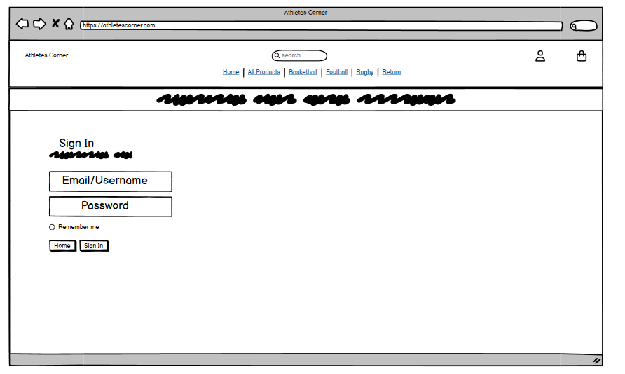

- **Sign Out Page**
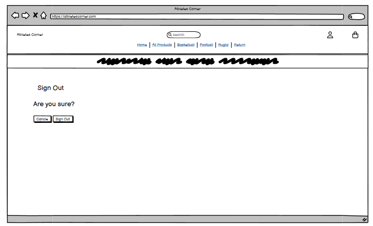

- **Profile Page**
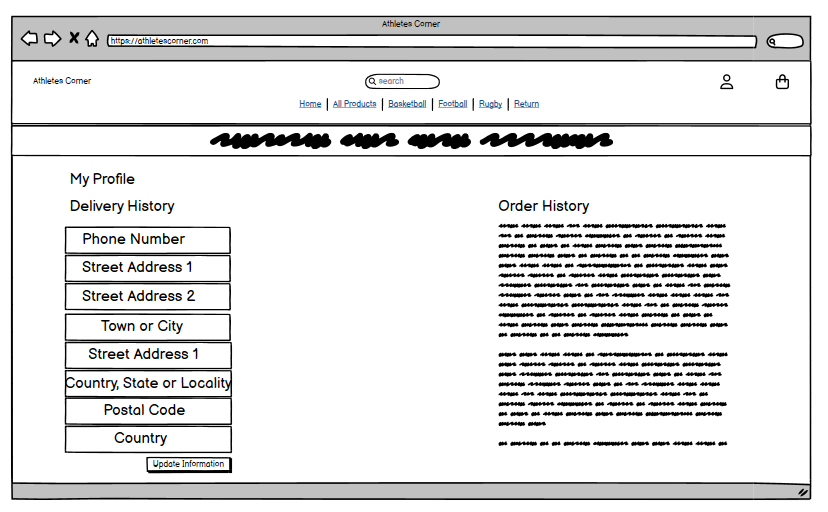

- **Product Management Page**
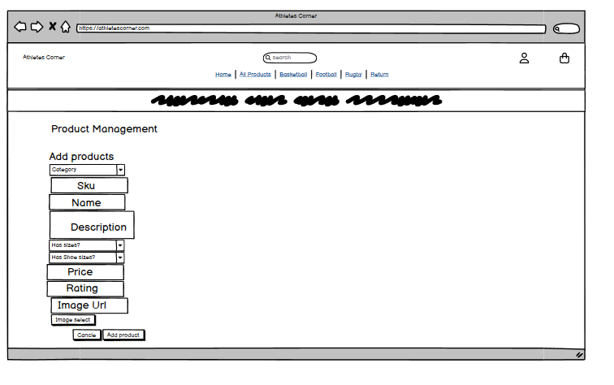

- **Bag Page**
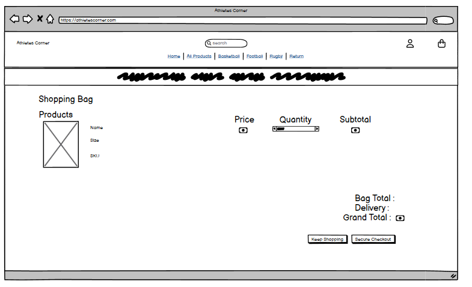

- **Checkout Page**
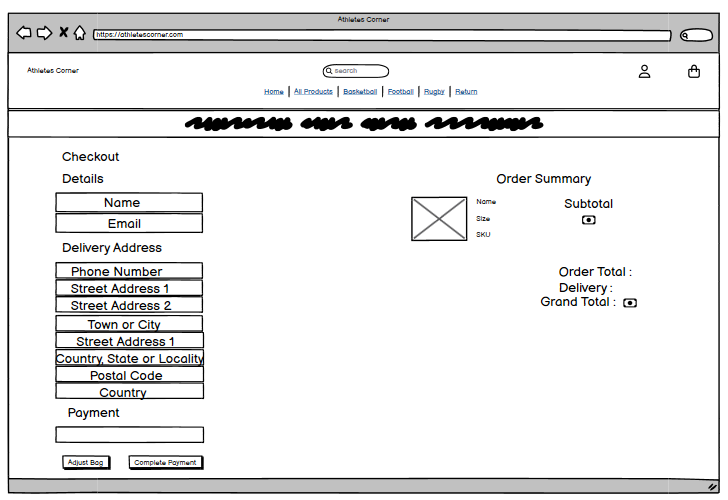

- **Checkout Success Page**
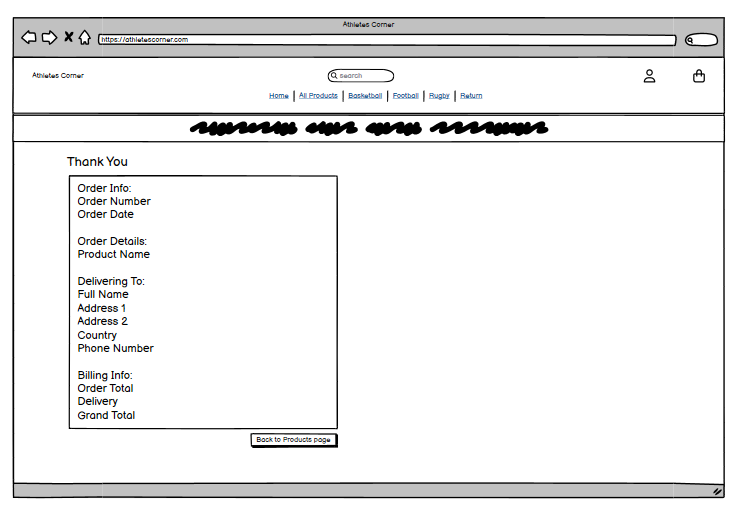

### Color Scheme

- I went with this colour scheme because the color blue is usally associated with sports and I used white to help contrast between the blue, black, and grey text that will be seen throughtout the website. 

- I only chose two colors because whilst researching mutiple sports websites like Footlocker, JD sports, and the Nike website a maximum of 3 different colors were present at each time.

### Database Design

## Features

This section goes over the different parts of this project. An explaination will be given of what the features provides the user.

### Existing Features

**Top Page**

- This will be shown on every page the user goes on.

- It contains a link to bring the user back to the home page(the store name).

- It contains a search bar to give the user a more tailored item finding tool.

- It contains a my account dropdown list which contains the link to their account page and the ability to sign in, sign out, or register.

- It also contains the checkout button for when a user finished browsing the catelog and want to pay for their oruder they can click that and get sent to the checkout section

**Nav Bar**

- This will be shown on every page the user goes on.

- The navbar contains the links to view all the products, a single product group (Basketball, Football, and Rugby), and specific types or products in these groups (shoes, jerseys, and gear).

- It also contains a link to a returns section if you feel like you have to return items

- Below the nav bar there is a message incentivising users to spend above $150 for free delivery. 

**Notifactions**

- When user do specific things like checkout, add products to bags, submit a return application, sign up to the newsletter, leave a review or edit products a notification comes up.

- This is used to give users confirmation throughout the site to not leave them questioning if they have done what they expected to do.

- There are 4 types of notifications, error, info, success, warning.

- The info is used to give users a message usually when they are doing something like editing a product.

- It will display an "Alert!" message above the text.

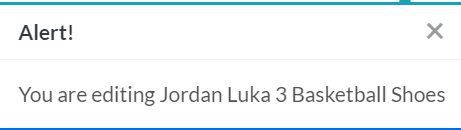

- The error message is shown when something is unable to properly work like a failed review edit.

- It will display an "Error!" message above the text.

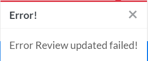

- The success message is shown when a objective a user wants to do works e.g. signing up to the newsletter, checkout or submitting a review

- It will display an "Success!" message above the text.

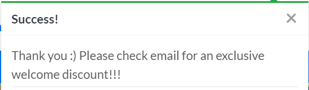

- The warning message is only used if the stripe public key is missing.

**Profile Page**

- This page shows the users order history and allows them to change their delivery details.

- This helps the user as it gives them easy access to find past orders and gives them the ability to quickly check out as their details will automatically be enter in the delivery field when they checkout.

**Product Management Page**

- This page is where users with staff status can add or edit products.

- The user can describe what category, name, price and rating the product has. 

- This is to give users with staff status a quicker and more efficent way of adding and editing products in the online store instead of going into the admin page.

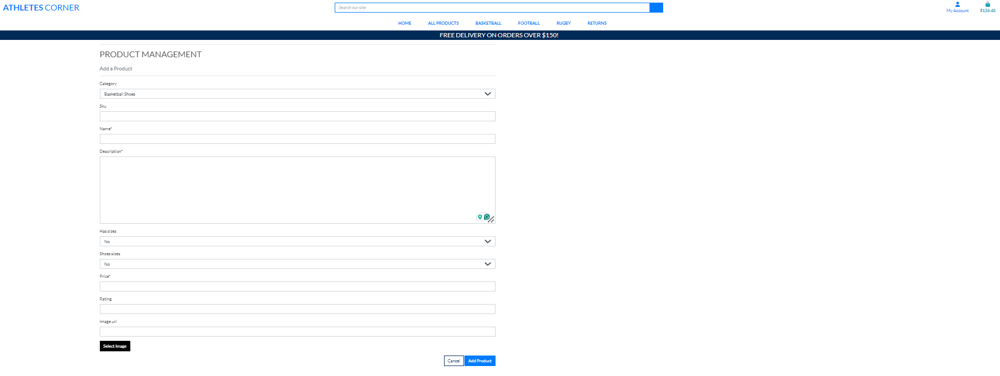

**Sign Out Page**

- This page allows user to remove thier accounts from any device.

- This helps the user as they can remove peoples ability to access their personal information if they use it on shared devices.

**Sign In Page**

- This page allows user to enter into thier accounts from any device.

- This helps the user as they have ability to access their personal information if they use it on any device.

**Sign Up Page**

- This page allows the user to create an account for the website.

- The creation of this account is what allows the user to save their delivery information, see past order history and create reviews.

**Returns Page**

- This page allows user to make a returns item request.

- This helps user give us a good outlook on why they want to return their order.

- It also gives them a quick and easy way to find out how to return their order.

**Bag Page**

- This page is for users to look over the products that they want to purchase.

- It shows them the name, price, quantity and subtotal.

- It also give them the ability to change the product quantity amount or remove the product from the bag.

- It can also show the user how close they are to getting free delivery if they have not hit the threshold yet.

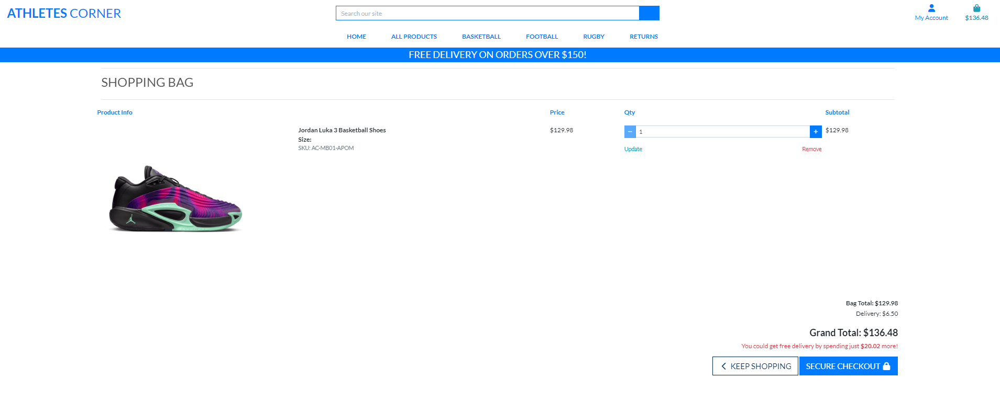

**Checkout Page**

- This is the last page of the website before a user makes their order.

- It allows them to see their order items one more time.

- It is where the user would put their order details like name, address, email and country they reside in.

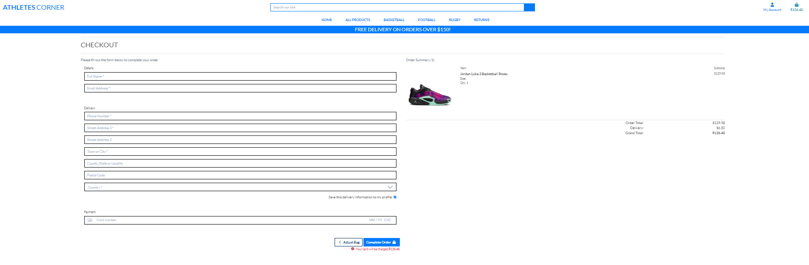

**Checkout Success Page**

- This page is used as a success page to show that the order has gone through.

-  It also give users a confirmation of their order number, date, details and address that will be put into the system.

- The user is also shown which email address it will be sent  to.

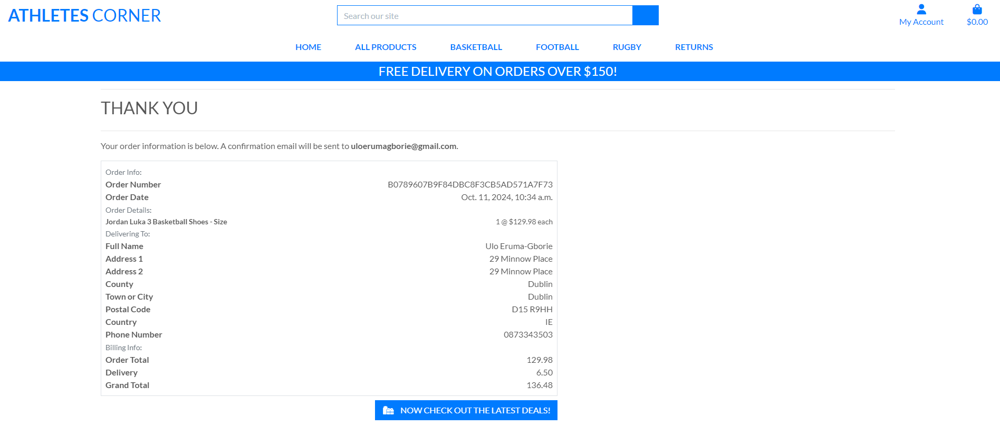

### Future Features

- Wishlist was a feature that I thought of putting on my website but due to prioites other features where added instead.

- Discount codes was also another feature I thought of putting on but aswell but chose to keep it close to the MVP.

- I thought about sending emails for Newsletters and Returns but just like discounts, I chose to keep this close to the MVP.

## Testing

Testing can me found on the [TESTING.md](TESTING.md)

## Technologies Used

This project used a varitey of coding languages, tools, librares and frameworks to build, style and run the app.

### Languages Used

- Python

- Javascript

- CSS

- HTML

### Libraries & Frameworks

- Asgiref 3.8.1
- Boto3 1.35.29
- Botocore 1.35.29
- Dj-database-url 0.5.0
- Django 3.2.25
- Django-allaut 0.50.0
- Django-countrie 7.2.1
- Django-crispy-form 1.14.0
- Django-extension 3.2.3
- Django-storage 1.14.4
- Gunicor 23.0.0
- Jmespat 1.0.1
- Oauthli 3.2.2
- Pillo 10.4.0
- Psycopg 2.9.9
- PyJW 2.9.0
- Python3-openi 3.2.0
- Pytz 2024.1
- Requests-oauthlib 2.0.0
- S3transfer 0.10.2
- Sqlparse 0.5.1
- Stripe 10.10.0

### Tools

- Github
- Gitpod
- W3C HTML Validator
- W3C CSS Validator
- JSHint
- Font Awsome
- Looka

## Deployment

Three steps were used when deploying this website:

1. Creating Heroku App. 
2. Connecting Heroku to Stripe for payment configuration.
3. Connecting Heroku to Amazon Web Services to store static and media files.

**Heroku Deployment**

  1. Create an account on [Heroku](https://dashboard.heroku.com/apps).

  2. In the Heroku Dashboard click create a new app.

  3. Type in the app name (athletes-corneru) and select region (Europe) and click create app.

  4. Once done go to settings and click reveal config vars.

  5. Inside config vars add the word "DATABASE_URL" to key with a value of the database url from the PostgreSQL that was given from Code Institute.

  6. Next add the word "SECRET_KEY" to key with a value of the secret key you name (this key is then removed from the settings.py file).

  7. Connect the Github to the heroku through the deploy section of the page.

  8. Finally activate automatic deploys.

**Stripe**

  1. Create and account on [Stripe](https://stripe.com/ie).

  2. In Heroku go back to settings and reveal config vars then add your Stripe public and secret key.

  3. Create a webhook and select all events.

  4. Then add your heroku URL to the endpoint URL with the addition of /checkout/wh/ (e.g. https://xxxx.com/checkout/wh/)

  5. Go back to Heroku and add the stripe webhook secret key to the config vars.

**Amazon Web Services**

  1. Create an [AWS](https://aws.amazon.com/free/?trk=d5254134-67ca-4a35-91cc-77868c97eedd&sc_channel=ps&ef_id=Cj0KCQjw99e4BhDiARIsAISE7P8GFY3G_vJGdC1mh0Y5sLDqNP6Qx9UtDLRtse2jtjoz-v-U6FHK9RoaAl6wEALw_wcB:G:s&s_kwcid=AL!4422!3!433803620861!e!!g!!amazon%20web%20services!1680401428!67152600204&gclid=Cj0KCQjw99e4BhDiARIsAISE7P8GFY3G_vJGdC1mh0Y5sLDqNP6Qx9UtDLRtse2jtjoz-v-U6FHK9RoaAl6wEALw_wcB) account.

  2. Once created go to the S3 and create a bucket.

  3. Inside the bucket turn on static website hosting.

  4. In the permissions tab add the following to the CORS configuration:
    
    [
      {
        "AllowedHeaders": [
        "Authorization"
        ],
        "AllowedMethods": [
        "GET"
        ],
        "AllowedOrigins": [
        "*"
        ],
        "ExposeHeaders": []
      }
    ]

  5. Then go to the bucket policy generator to create a security policy for this bucket (policy type = S3 bucket policy).

  6. Then generate policy and add policy in the bucket policy editor (adding a /* to the end of resource key).

  7. Go to access control list and put public access to everyone.

  8. Go to IAM section.

  9. Go to groups part

  10. Create a group.

  11. Go to policy part.

  12. Create a policy.

  13. In policy creation, import the S3 Full Access policy.

  14. Add the bucket ARN into the resource section.

  15. Attach policy to group.

  16. Go to user.

  17. Add a user.

  18. Add user to group.

  19. Get the user key and secret access key from a .csv file made when adding the user.

  

## Credits

**Layout**

- The layout was taken from the Code Institute project [Boutique-Ado](https://github.com/Code-Institute-Solutions/boutique_ado_v1/tree/933797d5e14d6c3f072df31adf0ca6f938d02218).

**Reviews Form**

- The Review section layout was taken from the code institute [i think therefore i blog](https://learn.codeinstitute.net/ci_program/diplomainfullstacksoftwarecommoncurriculum).

**Logo**

- The logo was created using [Looka](https://looka.com/logo-maker/?gad_source=1&gclid=CjwKCAjwko21BhAPEiwAwfaQCBaSXuNOSQH7pCUHNiMb9HN7ELRIqC5eUdh3_e5hNUJSRkRM4QMiYhoC4acQAvD_BwE).

**Icons**

- The icons used throughout the app (My account button, Checkout button etc) was made using [Font Awsome](https://fontawesome.com/).