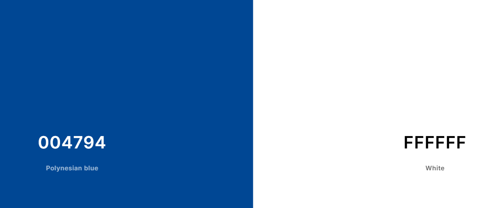

# Athletes Corner

Athletes Corner is a sports e-commerce created for people who are looking for sports gear, jerseys or shoes for basketball, football, and rugby. This website aims to give users a quick and easy way to search for sporting goods and see if they are worth buying.

## User Experience

### First Time Visitors

I wanted first time visitos to be able to:

- Easily use the site across a wide range of devices.

- Easily find where to go for each product.
 
- Easily be able to search for products.

### Frequent Visitors

I  wanted Frequent visitos to be able to:

- Create an account.

- Save details like delivery information and order history.

- Review products.

### Site Admin

I wanted site admins to be able to:

- Add, edit or delete products or reviews from the store using site owner only front end page.

## Design

### Wireframes

- **Home Page**

- **Products Page**

- **Product Details Page**

- **Returns Page**

### Color Scheme

- I went with this colour scheme because the color blue is usally associated with sports and I used white to help contrast between the blue, black, and grey text that will be seen throughtout the website. 

- I only chose two colors because whilst researching mutiple sports websites like Footlocker, JD sports, and the Nike website a maximum of 3 different colors were present at each time.

### Database Design

## Features

This section goes over the different parts of this project. An explaination will be given of what the features provides the user.

### Existing Features

**Top Page**

- This will be shown on every page the user goes on.

- It contains a link to bring the user back to the home page(the store name).

- It contains a search bar to give the user a more tailored item finding tool.

- It contains a my account dropdown list which contains the link to their account page and the ability to sign in, sign out, or register.

- It also contains the checkout button for when a user finished browsing the catelog and want to pay for their oruder they can click that and get sent to the checkout section

**Nav Bar**

- This will be shown on every page the user goes on.

- The navbar contains the links to view all the products, a single product group (Basketball, Football, and Rugby), and specific types or products in these groups (shoes, jerseys, and gear).

- It also contains a link to a returns section if you feel like you have to return items

- Below the nav bar there is a message incentivising users to spend above $150 for free delivery. 

**Profile Page**

- This page shows the users order history and allows them to change their delivery details.

- This helps the user as it gives them easy access to find past orders and gives them the ability to quickly check out as their details will automatically be enter in the delivery field when they checkout.

**Sign Out Page**

- This page allows user to remove thier accounts from any device.

- This helps the user as they can remove peoples ability to access their personal information if they use it on shared devices.

**Sign In Page**

- This page allows user to enter into thier accounts from any device.

- This helps the user as they have ability to access their personal information if they use it on any device.

**Sign Up Page**

- This page allows the user to create an account for the website.

- The creation of this account is what allows the user to save their delivery information, see past order history and create reviews.

**Returns Page**

- This page allows user to make a returns item request.

- This helps user give us a good outlook on why they want to return their order.

- It also gives them a quick and easy way to find out how to return their order.

